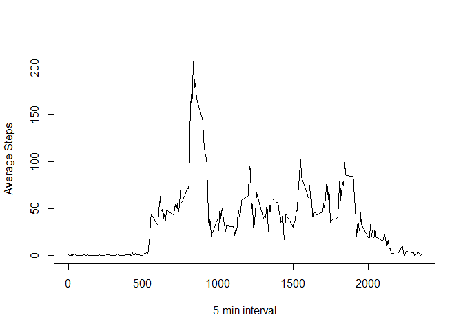
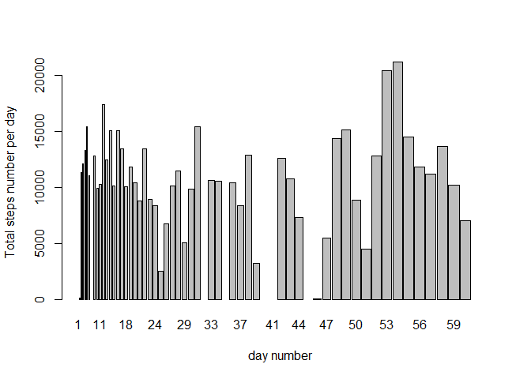

# Reproducible Research: Peer Assessment 1


## Loading and preprocessing the data

```r
setwd("C:/EMC/Education/Data_Science/Reproducible Research/Project1")
unzip("./RepData_PeerAssessment1/activity.zip",exdir = "./RepData_PeerAssessment1") 
activities <- read.csv("./RepData_PeerAssessment1/activity.csv", header = TRUE, na.strings="NA")
```

## Question 1: What is mean total number of steps taken per day?

```r
#install.packages("dplyr")
library(dplyr)
```

```
## Warning: package 'dplyr' was built under R version 3.2.3
```

```
## 
## Attaching package: 'dplyr'
## 
## The following objects are masked from 'package:stats':
## 
##     filter, lag
## 
## The following objects are masked from 'package:base':
## 
##     intersect, setdiff, setequal, union
```

```r
days <- group_by(activities, date)
Summa <- summarize(days, steps = sum(steps, na.rm=TRUE))
Summa$daynum <- as.numeric(Summa$date)
barplot(Summa$steps, Summa$daynum, names.arg= Summa$daynum, ylab="Total steps number per day", xlab="day number")
```

 

```r
summary(Summa)
```

```
##          date        steps           daynum  
##  2012-10-01: 1   Min.   :    0   Min.   : 1  
##  2012-10-02: 1   1st Qu.: 6778   1st Qu.:16  
##  2012-10-03: 1   Median :10395   Median :31  
##  2012-10-04: 1   Mean   : 9354   Mean   :31  
##  2012-10-05: 1   3rd Qu.:12811   3rd Qu.:46  
##  2012-10-06: 1   Max.   :21194   Max.   :61  
##  (Other)   :55
```
Mean total number of steps taken per day is 9354;
Median total number of steps taken per day is 10395

## Question 2: What is the average daily activity pattern?

```r
intervals <- group_by(activities, interval)
avg <- summarize(intervals, steps = mean(steps, na.rm=TRUE))
plot(avg$interval, avg$steps, type="l", xlab="5-min interval", ylab="Average Steps")
```

 

```r
summary(avg)
```

```
##     interval          steps        
##  Min.   :   0.0   Min.   :  0.000  
##  1st Qu.: 588.8   1st Qu.:  2.486  
##  Median :1177.5   Median : 34.113  
##  Mean   :1177.5   Mean   : 37.383  
##  3rd Qu.:1766.2   3rd Qu.: 52.835  
##  Max.   :2355.0   Max.   :206.170
```

```r
filter(avg,steps==max(steps))
```

```
## Source: local data frame [1 x 2]
## 
##   interval    steps
##      (int)    (dbl)
## 1      835 206.1698
```
The "5-minute interval", on average across all the days containing the maximum number of steps is "835": hh:mm 13:55.

## Question 3: Imputing missing values

```r
summary(activities)
```

```
##      steps                date          interval     
##  Min.   :  0.00   2012-10-01:  288   Min.   :   0.0  
##  1st Qu.:  0.00   2012-10-02:  288   1st Qu.: 588.8  
##  Median :  0.00   2012-10-03:  288   Median :1177.5  
##  Mean   : 37.38   2012-10-04:  288   Mean   :1177.5  
##  3rd Qu.: 12.00   2012-10-05:  288   3rd Qu.:1766.2  
##  Max.   :806.00   2012-10-06:  288   Max.   :2355.0  
##  NA's   :2304     (Other)   :15840
```
NA values are 2304


```r
activities$steps[is.na(activities$steps)] <- mean(avg$steps)
```
NA values are now substituted by mean steps value per day


```r
SummawNA <- summarize(days, steps = sum(steps))
SummawNA$daynum <- as.numeric(SummawNA$date)
barplot(SummawNA$steps, SummawNA$daynum, names.arg= SummawNA$daynum, ylab="Total steps number per day", xlab="day number")
```

 

```r
summary(SummawNA)
```

```
##          date        steps           daynum  
##  2012-10-01: 1   Min.   :   41   Min.   : 1  
##  2012-10-02: 1   1st Qu.: 8841   1st Qu.:16  
##  2012-10-03: 1   Median :10765   Median :31  
##  2012-10-04: 1   Mean   :10766   Mean   :31  
##  2012-10-05: 1   3rd Qu.:13294   3rd Qu.:46  
##  2012-10-06: 1   Max.   :21194   Max.   :61  
##  (Other)   :55   NA's   :8
```
Mean total number of steps taken per day (including NAs) is 10765;
Median total number of steps taken per day (including NAs) is 10766
Both Mean and Median values are greater than without NAs


## Are there differences in activity patterns between weekdays and weekends?
